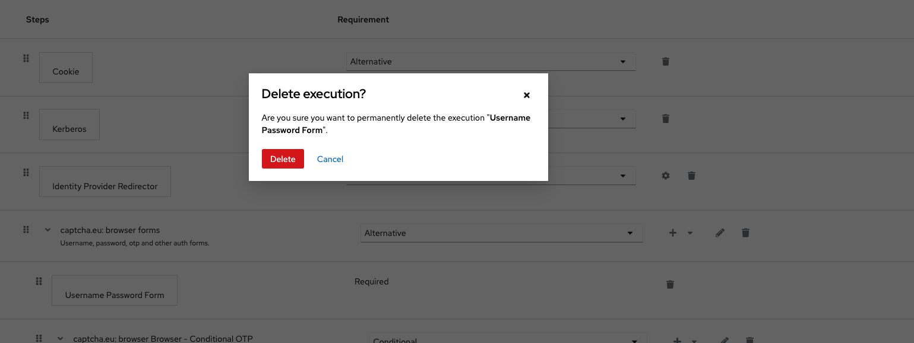
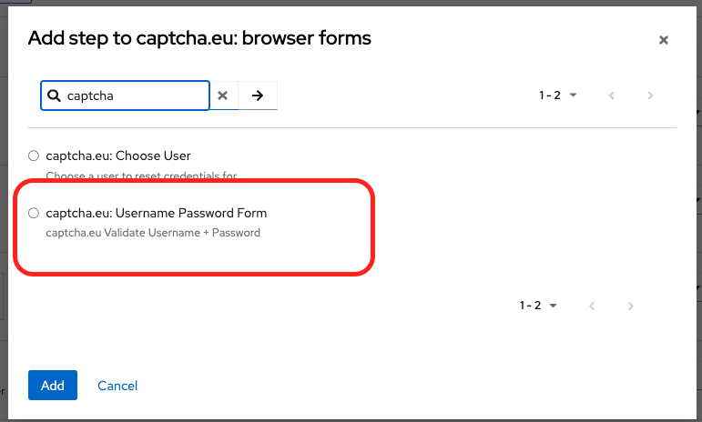
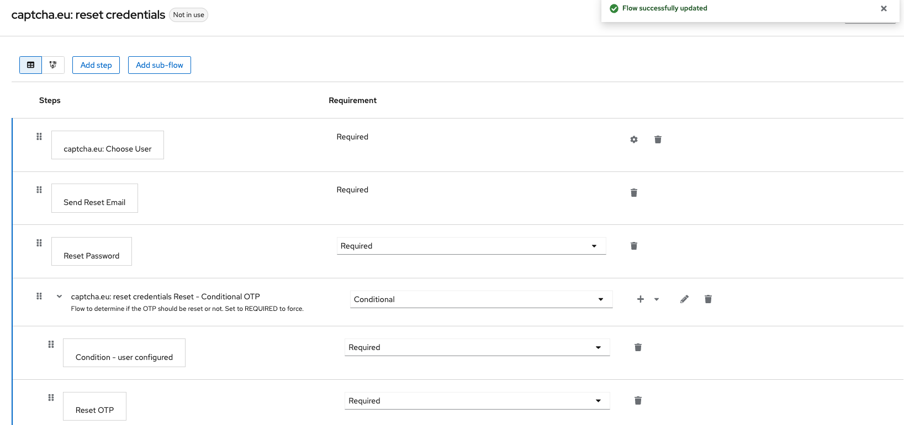

# KeyCloak

KeyCloak is in beta, to participate in the beta and get access to the source/jar plugin please contact hello@captcha.eu. we are happy to bring you in the beta team.

The extension, provides captcha.eu support for the following keycloak parts/flows:

- Browser (login)
- Registration
- Reset-credentials

You just follow a few steps and your keycloak is ready to use captcha.eu

## Obtain the Extension

Contact hello@captch.eu

```sh
mvn package
```

Put the resulting `target/keycloak-captcha.jar` into your extension folder and restart keycloak.

## Configure the Authentication Flows

### Browser (Login)

- Go to Authentication and select "browser" - and duplicate it.
  

- Now delete the "Username Password Form"



- in the "browser forms" add a new step. and choose captcha.eu:



- configure the form by pressing on the settings gear, in the modal enter your captcha.eu settings:


- bind the flow to the prod one:


- Enable the Frontend Code:

You either add the following snippet to your existing - `login.ftl`
right after the `</form>` closing tag.

```html
<#if captchaEnabled ??>
    <script>
        var CaptchaDOMReady = function (callback) {
          document.readyState === "interactive" || document.readyState === "complete"
            ? callback()
            : document.addEventListener("DOMContentLoaded", callback);
        };
        CaptchaDOMReady(function() {
            KROT.setup("${captchaEUPublicKey}");
            var f = document.getElementById("kc-form-login");
            KROT.interceptForm(f);
        });
    </script>
</#if>
```

You could optionally use our theme, that ships with the extension source code and is located in `theme/captcha`

**Login is now Protected by Captcha.eu**


### Registration

- Go to Authentication and select "registration" - and duplicate it.
  

- Delete the "Recaptcha" element
- Add New Step, and put it at the place where recaptcha was


- set it to `required`
- configure it by pressing on the settings gear, in the modal enter your captcha.eu settings:


- bind the flow to the prod one:


- Enable the Frontend Code:

you either add the following snippet to your existing - `register.ftl`
right after the `</form>` closing tag.

```html
<#if captchaEnabled ??>
    <script>
        var CaptchaDOMReady = function (callback) {
            document.readyState === "interactive" || document.readyState === "complete"
                ? callback()
                : document.addEventListener("DOMContentLoaded", callback);
        };
        CaptchaDOMReady(function() {
            KROT.setup("${captchaEUPublicKey}");
            var f = document.getElementById("kc-register-form");
            KROT.interceptForm(f);
        });
    </script>
</#if>
```

you could optionally use our theme, that ships with the extension source code and is located in `theme/captcha`

**Registration is now Protected by Captcha.eu**


### Password Reset

- Go to Authentication and select "reset credentials" - and duplicate it.
  

- Delete the "Choose User" element
- Add New Step, select the `captcha.eu: Choose User`, and put it at the place where Choose User was


- configure it by pressing on the settings gear, in the modal enter your captcha.eu settings:


- bind the flow to the prod one:


- Enable the Frontend Code:

you either add the following snippet to your existing - `login-reset-password.ftl`
right after the `</form>` closing tag.

```html
<#if captchaEnabled ??>
    <script>
        var CaptchaDOMReady = function (callback) {
            document.readyState === "interactive" || document.readyState === "complete"
                ? callback()
                : document.addEventListener("DOMContentLoaded", callback);
        };
        CaptchaDOMReady(function() {
            KROT.setup("${captchaEUPublicKey}");
            var f = document.getElementById("kc-reset-password-form");
            KROT.interceptForm(f);
        });
    </script>
</#if>
```

you could optionally use our theme, that ships with the extension source code and is located in `theme/captcha`

**Registration is now Protected by Captcha.eu**